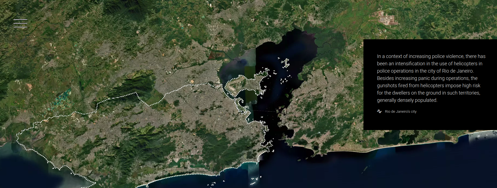
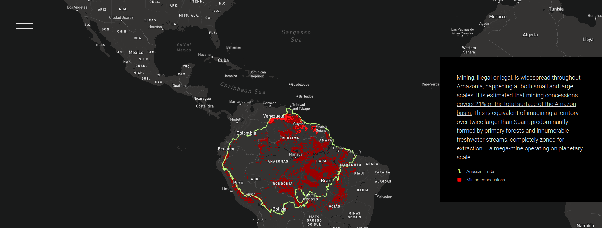

# ⚪ Métodos de scrollytelling

Em seu artigo '[Responsive scrollytelling best practices](https://pudding.cool/process/responsive-scrollytelling/)', publicando no The Pudding, Russell Goldenberg destaca duas abordagens principais para uma narrativas com scrollytelling. Uma delas é simplesmente empilhar textos, imagens, cartografias ou gráficos diversos. A outra consiste na rolagem de elementos sobre um fundo, em geral uma visualização de dados ou um mapa. No artigo, Goldenberg cita ainda outras abordagens possíveis, como usar o clique ou a função de deslizar, mas não as recomenda.

O Documental é uma solução que permite trabalhar com estas duas abordagens. É possível inclusive mesclar ambas, alternando rolagem sobre um fundo (no caso, um mapa, [representado pelos `Map Blocks`](publicando-uma-historia.md#map-blocks)) e seções com textos ou imagens fixas, empilhadas (como o elemento [`Article`](publicando-uma-historia.md#article)).

### Textos e narrativas

Em artigo sobre design cartográfico como uma forma de "storytelling" visual, Robert E. Roth recomenda que sejam selecionados elementos para garantir uma linearidade durante uma narrativa. Ele menciona a estrutura em três atos como a abordagem mais tradicional e também cita a tipologia proposta por Phillips (2012) com oitos arcos narrativos comumente utilizados nas geociências e geografia.

A narrativa clássica, em três atos, é baseada em 3 etapas: set-up ou introdução, conflito e resolução. Ao longo deste processo, são apresentados personagens (que podem ser pessoas, mas também regiões geográficas, por exemplo), informações contextuais sobre um problema e outras informações.

No início da narrativa, em geral, apresentam-se os personagens, ambientes e o contexto do problema em questão. Para scrollytelling baseados em mapas, é especialmente importante determinar uma ou mais localidades (onde?) e temporalidades (quando?). Também recomenda-se a inserção de uma "isca" (teaser ou click-bait) para capturar a atenção da pessoa leitora e gerar interesse na narrativa.

No segundo ato, o conflito, Roth enfatiza a criação incremental de uma tensão e o desenvolvimento dos personagens, a fim de gerar um maior interesse da audiência. Ele sugere a criação de "pontos narrativos", que podem ser pontos distintos em um mesmo mapa ou uma sequência de mapas e gráficos, para construir pausas e ritmos dentro de uma narrativa linear.

O pesquisador destaca os oito arcos narrativos identificadas por Philips (2012) para narrativas baseadas em mapas. Eles dividem-se em dois grupos. Quatro destes arcos são baseados em um único protagonista (um local ou região, onde o conflito surge de forças internas ou externas). Estes quatro arcos narrativos são: a destruição, a gênese, a emergência ou a metamorfose. Os outros quatros baseiam-se no conflito entre duas ou mais forças ou personagens, que pode resultar em uma nova situação. Estes outros quatro arcos são: causa e efeito, convergência, divergência e oscilação.

.png>)

Por fim, na resolução, o ato final da estrutura narrativa em três etapas, chega-se ao climax. Esta conclusão pode se dar tanto com a convergência dos personagens, problemas e ambientações criadas por uma determinada solução, quanto deixando a carga da audiência preencher as lacunas de sentido com suas próprias experiências.

Como Roth, destaca muitos profissionais consideram este esquema super-simplificado e adotam estruturas não-lineares ou paralelas para contar histórias. De todo modo, ainda assim, estes elementos e estruturas básicas podem estimular novas práticas e abordagens para contar histórias com mapas.

### Definição da camada base

A camada base serve como a principal camada de localização espacial, a partir da qual serão posicionadas outras camadas de informações ou dados. Esta camada base pode ser uma imagem de satélite ou marcações vetoriais. No primeiro caso, temos um efeito mais realista, que visa transmistir a sensação de deslocamento em um espaço real. As imagens de satélite como a camada base de um mapa também permitem que objetos e entidades (prédios, marcas de desmatamento ou cidades, por exemplo) apareçam no mapa "tal como" são na realidade.

Por outro lado, um mapa base vetorial abstrai qualquer informação visual desnecessária para representar apenas alguns elementos. Deste modo, esta abordagem é muitas vezes utilizada para visualizações de dados geográficos, uma vez que com a camada vetorial podemos escolher o que será exibido (como fronteiras, nomes de rua, etc).

### Movimentos de câmera sobre mapas

#### Aproximar ou afastar (Zoom in/out)

O movimento de aproximar ou afastar a visão sobre o mapa ajuda as narrativas a alternarem entre uma dimensão "macro" (uma visão mais ampla para situar geograficamente o leitor ou um mapa cloroplético, por exemplo) e "micro" (pontos no mapa relacionados a fotos ou uma subdivisão fronteiriça como os municípios dentro de um estado). O movimento de "zoom in" pode ser uma estratégia para abordar algo mais específico depois de tratar questões mais gerais (dedução), enquanto o contrário "zoom out" permite generalizar (indução) ou contrapor uma experiência em específica com uma visão mais ampla. Este efeito é obtido criando dois ou map '_map blocks_' onde o sucessor tem um valor de "_zoom_" diferente (maior ou menor para _zoom in_ ou _zoom out_, respectivamente) que o anterior.

#### Panorâmica (panning)

Este movimento permite "passear" por um mapa. É útil para detalhar trajetórias ou tratar de uma sequência de acontecimentos/localizações relevantes para a narrativa. Este movimento pode ser alcançado usando differentes coordenadas geográficas para latitude e longitude em diferentes '_map blocks'._

#### Bearing e pitching

O [Mapbox oferece opções de controle de câmera](https://docs.mapbox.com/mapbox-gl-js/example/set-perspective/) que permitem também ajustar a altura e posição da perspectiva do mapa. Este recurso dá a impressão de uma navegação em 3 dimensões e é útil para buscar reproduzir uma determinada perspectiva/visão (como a de uma foto) no mapa, por exemplo.

#### Sobreposição de imagens

O Documental também dá suporte a comparações de imagens no estilo antes/depois. Este recurso é útil especialmente para mostrar transformações temporais em um dado território, permitindo ao visitante comparar facilmente duas imagens. Neste caso, os mapas devem ser salvos como imagens e enviados usando a opção 'Article > Compare'.

## Referências

Robert E. Roth (2020): Cartographic Design as Visual Storytelling: Synthesis and Review of Map-Based Narratives, Genres, and Tropes, The Cartographic Journal, DOI: 10.1080/00087041.2019.1633103

Phillips J. (2012): Storytelling in Earth Sciences: The Eight Basic Plots - Earth-Science Reviews 115 (3) pp.153–162 DOI:10. 1016/j.earscirev.2012.09.005.
