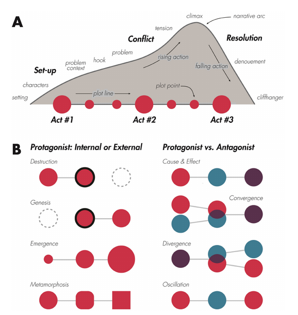

# 🖱️Técnicas de scrollytelling

## 🖱️ Técnicas de scrollytelling

Esta seção tem por objetivo consolidar informações e sugestões sobre a construção de narrativas usando scrollytelling com mapas. Ao fim do documento, há uma lista de leituras complementares.

### Soluções para scrollytelling

#### JavaScript

Svelte + Observable



Mapbox: [https://demos.mapbox.com/scrollytelling/](https://demos.mapbox.com/scrollytelling/)

[https://github.com/mapbox/storytelling](https://github.com/mapbox/storytelling)

Flourish> [https://help.flourish.studio/article/21-controlling-stories-with-scrollytelling](https://help.flourish.studio/article/21-controlling-stories-with-scrollytelling)

Documental.xyz

### Métodos de scrollytelling

Em seu artigo '[Responsive scrollytelling best practices](https://pudding.cool/process/responsive-scrollytelling/)', publicando no The Pudding, Russell Goldenberg destaca duas abordagens principais para uma narrativa do tipo. Uma delas é simplesmente empilhar textos, imagens, cartografias ou gráficos diversos. A outra consiste na rolagem de elementos sobre um fundo, em geral uma visualização de dados ou um mapa. No artigo, Goldenberg cita ainda outras abordagens possíveis, como usar o clique ou a função de deslizar, mas não as recomenda.

O Documental é uma solução que permite trabalhar com estas duas abordagens. É possível inclusive mesclar ambas, alternando entre textos ou imagens fixas.

### Textos e narrativas

Em artigo sobre design cartográfico como uma forma de "storytelling" visual, Robert E. Roth recomenda que sejam selecionados elementos para garantir uma linearidade durante uma narrativa. Ele menciona a estrutura em três atos como a abordagem mais tradicional e também cita a tipologia proposta por Phillips (2012) com oitos arcos narrativos comumente utilizados nas geociências e geografia.

A narrativa em três atos é baseada em 3 etapas: set-up ou introdução, conflito e resolução. Ao longo deste processo, são apresentados personagens (que podem ser pessoas mas também regiões geográficas, por exemplo), informações contextuais sobre um problema e outras informações. Cada uma destas 3 etapas encontra-se comentada abaixo.

Já os oito arcos identificadas por Philips dividem-se em dois grupos. Quatro destes arcos são baseados em um único protagonista (um local ou região, onde o conflito surge de forças internas ou externas). Estes quatro arcos narrativos são: a destruição, a gênese, a emergência ou a metamorfose. Os outros quatros baseiam-se no conflito entre duas ou mais forças ou personagens, que pode resultar em uma nova situação. Estes outros quatro arcos são: causa e efeito, convergência, divergência e oscilação.

### Definição do mapa base

### Movimentos de câmera sobre mapas

#### Zoom in/out

O movimento de aproximar ou afastar a visão sobre o mapa ajuda as narrativas a alternarem entre uma dimensão "macro" (uma visão do globo terrestre para situar geograficamente o leitor ou um mapa cloroplético, por exemplo) e "micro" (pontos no mapa relacionados a fotos ou uma subdivisão fronteiriça como os municípios dentro de um estado).

#### Pan

#### Sobreposição de imagens

## Referências

Robert E. Roth (2020): Cartographic Design as Visual Storytelling: Synthesis and Review of Map-Based Narratives, Genres, and Tropes, The Cartographic Journal, DOI: 10.1080/00087041.2019.1633103

Phillips J. (2012): Storytelling in Earth Sciences: The Eight Basic Plots - Earth-Science Reviews 115 (3) pp.153–162 DOI:10. 1016/j.earscirev.2012.09.005.

